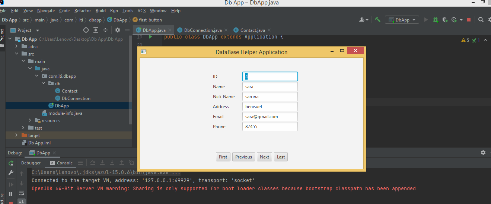
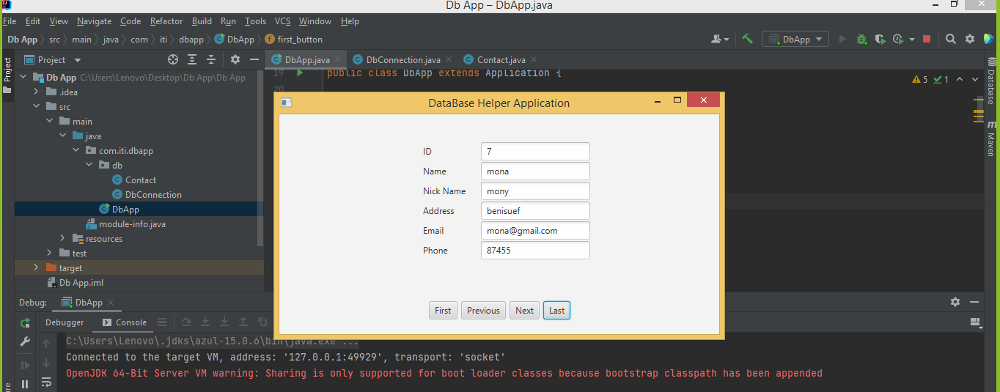
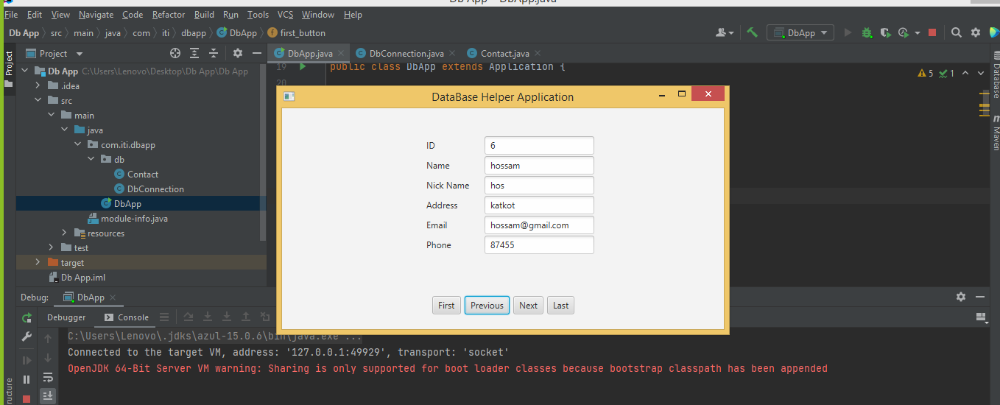

ShowDatabase-java:+1:📜

>--Developed By :  1-Sara Galal. 
                    2-Aml Abdellatif. 
                    
About the project:-
 >This project make to show result from database, using java, javafx. 
 >This project work with any type of database. 
 
Steps:-
>1. Fristwe create a class names "contact" to identify our main variables <b>(columns name)</b>to represent the table contact. 
>2. Then we create a class named "DbConnection" to stablish a connection between our application and the postgress driver. 
>3. Finally we create DbApp class to make the <b>GUI</b> for application. 

Main Function:-
>▶next:show the next row in the table. 
>▶prev:show the prev row in the table. 
>▶first:show the first row in the table. 
>▶last:show the last row in the table. 

Images:- 
Home Page

Last row in table

Prev row  ih table

